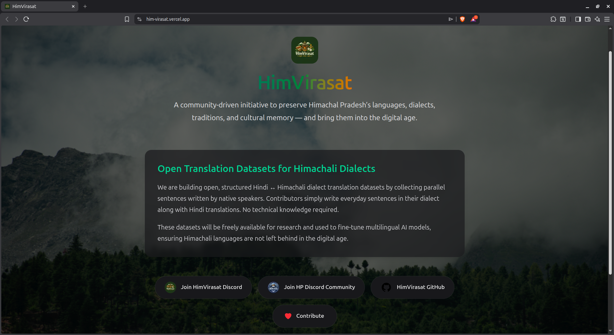

# HimVirasat-Web

<div align="center">
  
  
  **Preserving Himachal's Linguistic Heritage Through Technology**
  
  [](https://discord.gg/PgJWcFXRTB)
  [](https://github.com/HimVirasat)
  [](https://nextjs.org/)
  [](https://www.typescriptlang.org/)

</div>

---

## 📖 What is HimVirasat?

**HimVirasat** (Him = Snow/Himalayas, Virasat = Heritage) is an **open-source, community-driven initiative** dedicated to documenting, preserving, and digitally representing the languages and dialects of Himachal Pradesh. 

We are building the **Himachali Languages Initiative** — a platform that enables native speakers to contribute translation datasets between local dialects and Hindi, creating freely available linguistic resources for education, research, and future language technologies.

---

## 🎯 Mission & Goals

### Our Core Mission
Build open, high-quality parallel datasets for Himachali dialects and ensure these languages are represented in the digital ecosystem.

### What We Aim to Achieve
- **Build Open Translation Datasets**: Create parallel Hindi ↔ Himachali dialect datasets through community contributions
- **Preserve Cultural Knowledge**: Document linguistic and cultural heritage through native speaker participation
- **Enable NLP Research**: Provide resources for low-resource language research and development
- **Digital Representation**: Ensure Himachali languages are not left behind in the AI and digital age
- **Community Empowerment**: Make contribution accessible to everyone — no technical knowledge required

### How We Work
1. **Native speakers** contribute sentences via simple submission forms
2. **Data is cleaned, structured, and released openly**
3. **Technical contributors** help with validation, modeling, and tools
4. **All work is transparent and community-driven**

---

## 🚨 Problems We're Solving

### The Challenge
Many Himachali dialects are **actively spoken but largely absent** from modern digital tools and research. This creates several critical issues:

- **Digital Exclusion**: Himachali languages have minimal presence in translation tools, voice assistants, and AI systems
- **Language Endangerment**: Younger generations are losing connection to their linguistic heritage
- **Research Gap**: Lack of structured datasets prevents academic and commercial NLP development
- **Cultural Loss**: Oral traditions and dialectical knowledge risk disappearing without documentation

### Our Solution
By building **community-contributed, open-access translation datasets**, we provide:
- Resources for developing translation models and language tools
- A sustainable, scalable model for dialect preservation
- A bridge between traditional knowledge and modern technology
- Foundation for future educational and research applications

---

## 🛠️ Tech Stack

### Frontend
- **Framework**: [Next.js 15.5.9](https://nextjs.org/) (React 18.2.0)
- **Language**: [TypeScript 5.3.0](https://www.typescriptlang.org/)
- **Styling**: [Tailwind CSS 4.0](https://tailwindcss.com/)
- **UI Components**: [Radix UI](https://www.radix-ui.com/), Custom components with shadcn/ui patterns
- **Icons**: [Heroicons](https://heroicons.com/), [Lucide React](https://lucide.dev/)
- **Theming**: next-themes for dark/light mode support

### Development Tools
- **Package Manager**: pnpm 8.15.0
- **Linting**: ESLint with Next.js and Prettier configurations
- **Testing**: Jest with React Testing Library
- **Git Hooks**: Husky + lint-staged for pre-commit quality checks
- **Commit Standards**: Commitlint with conventional commits

### Deployment & Infrastructure
- Optimized for static export and edge deployment
- Environment-agnostic build system
- Performance-first architecture

---

## 🚀 Getting Started

### Prerequisites
- **Node.js**: v18 or higher
- **pnpm**: v8.15.0 (recommended) or npm/yarn

### Installation

1. **Clone the repository**
   ```bash
   git clone https://github.com/mclovin22117/HimVirasat-web.git
   cd HimVirasat-web/himvirasat-frontend

2. **install dependecies**
    pnpm install
    or
    npm install

3. **Run the development server**
    pnpm dev
    or
    npm install

4. **Open your browser**
    http://localhost:3000

### Available Scripts

| Command | Description |
|---------|-------------|
| `pnpm dev` | Start development server on port 3000 |
| `pnpm build` | Create production build |
| `pnpm start` | Start production server |
| `pnpm lint` | Run ESLint checks |
| `pnpm format` | Format code with Prettier |
| `pnpm typecheck` | Run TypeScript type checking |
| `pnpm test` | Run test suite |

**Contributing**

We welcome contributions frm developers, linguists, designers, and native speakers!

For Code Contributors
Please read CONTRIBUTING.md for detailed guidelines on:
- Development workflow
- Branch naming conventions
- Pull request process
- Code standards

For Language Contributors
Visit our Contribute page or Discord community to start contributing translation pairs in your native dialect.

No technical knowledge required -- just your language expertise!

## Project Structure

A high-level overview of the repository structure:

```text
himvirasat-frontend/
├── app/                         # Next.js App Router
│   ├── page.tsx                 # Landing page
│   ├── layout.tsx               # Root layout
│   ├── globals.css              # Global styles
│   └── contribute/              # Contribution-related pages
├── components/                  # Reusable React components
│   ├── ui/                      # Shared UI components
│   └── DialectCard.tsx          # Dialect-specific component
├── lib/                         # Utility and helper functions
├── public/                      # Static assets
├── package.json                 # Dependencies & scripts
└── README.md                    # Project documentation
```

## Screenshots

### Home Screen


**Community & Support**
    - Discord: [[Join HimVirasat Community](https://discord.gg/JGaYxhRC)]
    - HP Discrod: [[Himachal Pradesh Community](https://discord.gg/EQhJG8AVX3)]
    - GitHub: [[HimVirasat](https://github.com/HimVirasat)]
    - Issues: [[Report Bugs or request features](https://github.com/HimVirasat/HimVirasat-web/issues)]

## Together, we are preserving Himachal's heritage for future generations.

## Made with ❤️ for Himachal Pradesh